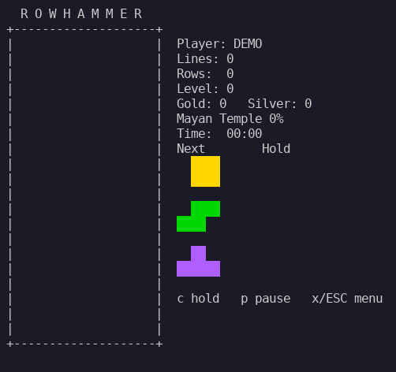
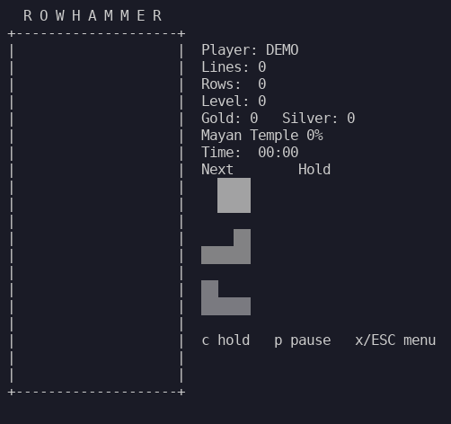
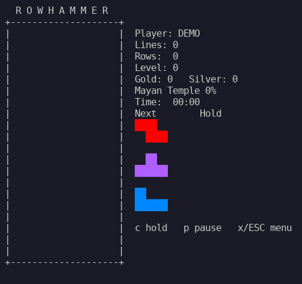

# rowhammer

Ein Tetris-artiges Spiel fuer das Terminal - komplett in **Bash**.

Vorbild ist **"The New Tetris"** (Nintendo 64): Mit jeder abgebauten Reihe
arbeitest du am Aufbau eines **Weltwunders**, das ueber alle Runden hinweg
Stueck fuer Stueck aus ASCII-Art entsteht. Auch das Quadrat-System des
Originals ist Teil des Konzepts: Wer aus vier Bausteinen ein 4x4-Quadrat baut,
erhaelt **Gold-** (sortenrein) oder **Silber-Bloecke** (gemischt), die beim
Abbau kraeftige Bonus-Reihen liefern.

Der Name ist ein Wortspiel: Hier werden Reihen (rows) gehaemmert - mit dem
gleichnamigen Hardware-Angriff hat das Spiel nichts zu tun.

## Vorschau

Kurze, echte Spielsequenzen - aufgenommen mit
[asciinema](https://asciinema.org/) und als GIF eingebettet. Die
zugehoerigen `.cast`-Dateien liegen unter [`docs/demo/`](docs/demo) und
lassen sich im Terminal abspielen, z. B.
`asciinema play docs/demo/gold.cast`. Neu erzeugen (aus echtem Spiel,
gegen das Debug-Log verifiziert) lassen sie sich mit der Toolchain unter
[`tools/demo/`](tools/demo): `python3 tools/demo/make_demos.py`.

<table>
  <tr>
    <td align="center" width="50%">
      <b>Tetris - vier Reihen auf einmal</b><br>
      <br>
      <sub>Neun Spalten fuellen, die Luecke rechts lassen - der stehende I-Stein raeumt vier Reihen (+1 Bonuszeile).</sub>
    </td>
    <td align="center" width="50%">
      <b>Silber-Quadrat</b><br>
      <br>
      <sub>Vier <em>gemischte</em> Teile fuellen ein 4x4-Feld - es wird zum Silber-Quadrat (+5 je Reihe beim Abbau).</sub>
    </td>
  </tr>
  <tr>
    <td align="center" width="50%">
      <b>Gold-Quadrat</b><br>
      <br>
      <sub>Vier <em>gleiche</em> Teile (hier vier O) im 4x4-Feld - das Gold-Quadrat bringt +10 je Reihe.</sub>
    </td>
    <td align="center" width="50%">
      <b>Weltwunder-Baustelle</b><br>
      <br>
      <sub>Der ueber alle Runden gesammelte Reihenstand baut Stueck fuer Stueck ein Weltwunder auf.</sub>
    </td>
  </tr>
</table>

## Status

**Phasen 1 bis 3 sind umgesetzt** (spielbarer Kern, Startmenue, die
The-New-Tetris-Mechaniken und der Weltwunder-Modus): Spielfeld,
7-Bag-Randomizer mit Vorschau auf
3 Teile, Hold, Gravitation mit Levelkurve, Reihenabbau, Soft-/Hard-Drop,
Pause, Game Over mit Neustart - und das **Quadrat-System**: Wer ein
4x4-Feld aus genau vier unversehrten Bausteinen baut, erhaelt ein Gold-
(sortenrein) oder Silber-Quadrat (gemischt); jede abgebaute Reihe bringt
+10 Bonuszeilen je Gold- und +5 je Silber-Quadrat (ein Tetris +1 extra)
fuer den "Rows"-Zaehler. Dieser Zaehler baut ueber alle Runden hinweg
sieben **Weltwunder** aus ASCII-Art auf, die Stueck fuer Stueck von
unten nach oben entstehen; der Fortschritt wird dauerhaft gespeichert
und nach jeder Runde sowie im Hauptmenue angezeigt. Die
Anwendung startet in einem Menue mit Einzelspieler,
Mehrspieler (Platzhalter), Highscores, Weltwunder, Statistik,
Einstellungen und einer kurzen Anleitung;
die besten
10 Runden werden dauerhaft gespeichert. Das vollstaendige Konzept
und die Roadmap stehen in [CLAUDE.md](CLAUDE.md).

## Spielen

Direkt aus dem Repository:

```
./rowhammer.sh
```

Oder als Debian-Paket installieren (siehe unten), dann:

```
rowhammer
```

Das Startmenue bietet:

- **Fortsetzen** - erscheint nur, solange eine ueber das Pausenmenue
  ins Hauptmenue gelegte Runde wartet, und nimmt sie wieder auf; der
  Eintrag steht dann auch im Einzelspieler-Menue an erster Stelle
- **Einzelspieler** - die Spielmodi: **Marathon** (endlos, Ende
  durch Game Over) und **Ultra** - 150 Rows so schnell wie moeglich
  abbauen. Die Ultra-Runde endet in dem Moment, in dem das Ziel
  erreicht ist; das Ergebnis ist die Spielzeit, und der HUD zeigt
  waehrenddessen Ziel ("Goal") und Restbedarf ("Left"). Gewertete Rows
  zaehlen, nicht physische Reihen - Gold- und Silberquadrate sind also
  die Abkuerzung ins Ziel. Erfolgreiche Laeufe landen in einer eigenen
  Bestenliste (`~/.config/rowhammer/highscore-ultra`, schnellster Lauf
  zuerst), die die 10 besten endlosen Runden unberuehrt laesst; ein
  Versuch, der vorher im Game Over endet, wird nicht eingetragen, seine
  Reihen zaehlen aber weiter fuer Weltwunder und Statistik. Die
  Anzeige dieser Liste im Menue folgt noch (bislang meldet nur das
  Rundenende-Bild den erreichten Rang)
- **Mehrspieler** - Platzhalter, folgt in einer spaeteren Phase
- **Highscores** - die besten 10 Runden, je Eintrag zwei Zeilen und
  seitenweise geblaettert: Name, Rows (die Punkte der Runde), Spielzeit
  und Datum in der ersten, Gold-/Silberquadrate, Rowhammer ("RH"),
  abgelegte Teile ("PCS") und Teile je Minute ("PPM") in der zweiten;
  ein Game Over zeigt den erreichten Rang direkt an
- **Weltwunder** - die aktuelle Baustelle mit Baustufe, Reihenstand
  und Gesamtfortschritt
- **Statistik** - auf zwei Bildschirmen: Gesamtzaehler ueber alle
  Runden (abgebaute Reihen, Bonusreihen, gebaute Gold- und
  Silberbloecke, die "Rowhammer" - vier Reihen auf einmal -, die
  abgelegten Teile, die Gesamtspielzeit und die daraus berechneten
  Steine/Minute), danach die Ergebnisse der letzten drei Spiele
- **Einstellungen** - Tastenbelegung aendern und Spielernamen setzen;
  beides wird in der Konfigurationsdatei gespeichert (Standard:
  `~/.config/rowhammer/rowhammer.conf`)
- **Anleitung** - kurze Spielerklaerung auf fuenf Bildschirmen, mit
  den Pfeiltasten links/rechts durchblaetterbar (umlaufend):
  Spielprinzip, Steuerung (mit der gerade eingestellten
  Tastenbelegung), Vorschau und Hold, Gold-/Silber-Quadrate mit ihrer
  Reihenwertung und der Weltwunderbau

Alle Spieldaten (Konfiguration, Highscores inklusive der Ultra-Liste,
Weltwunder-Spielstand,
Statistik) liegen im Datenverzeichnis
`~/.config/rowhammer`, aenderbar per `--data-dir`.

Optionen:

| Option           | Umgebungsvariable        | Wirkung                                  |
|------------------|--------------------------|------------------------------------------|
| `--seed N`       | `ROWHAMMER_SEED`         | Reproduzierbare Teilfolge                |
| `--name NAME`    | `ROWHAMMER_PLAYER_NAME`  | Spielername fuer die Highscore-Liste     |
| `--data-dir DIR` | `ROWHAMMER_DATA_DIR`     | Datenverzeichnis (Config, Scores, Save)  |
| `--no-color`     | `ROWHAMMER_NO_COLOR`     | Keine ANSI-Farben, je Steinsorte ein eigenes Zeichen (auch Standard-`NO_COLOR`, s. u.) |
| `--color-mode M` | `ROWHAMMER_COLOR_MODE`   | Farbpalette: `auto` (Standard), `basic`, `extended` |
| `--reset ZIEL`   | `ROWHAMMER_RESET`        | Persistente Daten zuruecksetzen und beenden (s. unten) |
| `--force`        | `ROWHAMMER_FORCE`        | Sicherheitsabfragen automatisch mit "ja" beantworten |
| `--debug`        | `ROWHAMMER_DEBUG`        | Session-Trace in Log-Dateien (s. unten)  |
| `--debug-dir DIR`| `ROWHAMMER_DEBUG_DIR`    | Zielverzeichnis fuer die Debug-Logs      |
| `-h/--help`      | -                        | Hilfe mit allen Optionen und Tasten      |

`--reset ZIEL` setzt gezielt gespeicherte Daten im Datenverzeichnis
zurueck und beendet das Spiel, ohne es zu starten. Moegliche Ziele:
`config` (die Konfigurationsdatei `rowhammer.conf`), `stats` (die
Statistik), `highscore` (beide Bestenlisten - `highscore` und
`highscore-ultra`), `save` (der Weltwunder-Fortschritt) oder `all`
(alles zusammen).

**Geloescht wird dabei nichts:** jede betroffene Datei wird nach
`<datei>-YYYYMMDDhhmmss.bak` im selben Verzeichnis verschoben, ein
Reset laesst sich also mit einem `mv` rueckgaengig machen. Wird
derselbe Reset zweimal in derselben Sekunde ausgefuehrt, wartet das
Spiel eine Sekunde und nimmt einen neuen Zeitstempel, statt das gerade
geschriebene Backup zu ueberschreiben.

Am Terminal werden die betroffenen Dateien erst aufgelistet und dann
abgefragt (`Move them aside? [N/y]`); die Vorgabe ist "nein",
verschoben wird nur nach einem ausdruecklichen `y`. `--force`
beantwortet die Abfrage automatisch mit "ja" und laesst sich mit allen
anderen Optionen kombinieren; ohne Terminal (Skript, CI) laeuft der
Reset ohnehin ohne Rueckfrage durch. Bereits fehlende Dateien sind kein
Fehler.

```
rowhammer.sh --reset highscore
rowhammer.sh --reset all --force
```

Der Debug-Modus zeichnet die komplette Session in drei korrelierte
Log-Dateien auf (Standardziel:
`~/.local/state/rowhammer/debug/<Zeitstempel>.<PID>`): `frames.log`
(jede Bildschirmausgabe 1:1), `input.log` (jeder Tastendruck) und
`events.log` (alle Spielaktionen samt Board-Snapshots). Das hilft,
Fehlverhalten oder Spielsituationen im Nachhinein exakt
nachzuvollziehen - z. B. fuer einen Bug-Report.

Ohne Farben (`--no-color`) bekommt jede Steinsorte ein eigenes
Zwei-Zeichen-Symbol (`II OO TT SS ZZ JJ LL`), damit sich die Steine auch
nach dem Ablegen noch unterscheiden lassen - Voraussetzung, um gezielt
Gold- (sortenrein) und Silber-Quadrate (gemischt) zu bauen. Die Quadrate
selbst heben sich mit eigenen Symbolen ab: Gold als `##`, Silber als
`%%`.

Zusaetzlich zu `--no-color`/`ROWHAMMER_NO_COLOR` wird die
De-facto-Standardvariable [`NO_COLOR`](https://no-color.org/) beachtet:
ist sie gesetzt und nicht leer, startet rowhammer ohne Farben. Das
projekteigene `ROWHAMMER_NO_COLOR` hat Vorrang - mit
`ROWHAMMER_NO_COLOR=0` laesst sich ein global exportiertes `NO_COLOR`
fuer rowhammer wieder ueberschreiben, und `--no-color` auf der
Kommandozeile gewinnt in jedem Fall.

Die Tastenbelegung laesst sich zusaetzlich per Umgebungsvariablen
`ROWHAMMER_KEY_*` uebersteuern (siehe `--help`); erlaubt sind `a`-`z`,
`0`-`9`, `SPACE` und `NONE` (kein Buchstabe fuer diese Aktion).
Praezedenz: CLI > Umgebungsvariable > Konfigurationsdatei > Standardwert.

## Features

Umgesetzt:

- Klassisches 10x20-Spielfeld, 7 Bausteine, 7-Bag-Randomizer
- Vorschau auf die naechsten 3 Teile und Hold (einmal pro Zug)
- **Quadrat-System:** Gold- (sortenrein) und Silber-Quadrate (gemischt)
  aus je vier unversehrten Teilen; jede geraeumte Reihe zaehlt 1 plus
  +10 je Gold- und +5 je Silber-Quadrat in der Reihe (additiv), ein
  Tetris bringt +1 extra ("Rows" im HUD) - bis zu 85 in einem Zug.
  Diese Reihenwertung ist zugleich das Punktesystem: nur abgebaute
  Reihen bringen Punkte, Drops und Quadrat-Bildung nicht
- Soft-/Hard-Drop, Rotation mit einfachen Wall-Kicks, Pause, Neustart
- **Blinkende Reihen beim Abbau:** vollstaendige Reihen blinken kurz
  auf (zweimal hell/normal, zusammen rund 280 ms), bevor sie
  verschwinden und das naechste Teil erscheint
- **Pausenmenue statt hartem Abbruch:** `Esc`/`x` unterbricht die
  Runde; sie kann ins Hauptmenue gelegt und dort ueber "Fortsetzen"
  wieder aufgenommen werden - gewertet wird erst beim echten Rundenende.
  Wer das Spiel verlaesst, waehrend noch eine pausierte Runde wartet,
  wird vorher gefragt
- Levelkurve (schneller je 10 Reihen)
- **Zentriertes Spielfeld-Layout:** ein festes 48x22-Feld, mittig im
  Terminal ausgerichtet - links der Hold-Stein und darunter die
  Rundenzaehler (Lines, Rows, Level, Gold, Silber, Rowhammer, Zeit,
  abgelegte Teile),
  das Spielfeld in der Mitte, die naechsten drei Steine oben rechts;
  Pause und Game Over erscheinen als Kasten ueber dem Spielfeld.
  Menues, Info-Bildschirme und die Weltwunder-Baustelle sind ebenfalls
  zentriert und buendig zum Spielfeld
- Farbige Darstellung ueber ANSI-Sequenzen, flackerfreies Rendering,
  sauberes Terminal-Restore beim Beenden
- **Inkrementelles Rendering:** je Frame werden nur die tatsaechlich
  geaenderten Zeilen neu geschrieben, unveraenderte Spielfeldreihen
  kommen aus einem Cache - rund 2x schnellerer Frame-Aufbau und ein
  Bruchteil der Terminal-Ausgabe gegenueber dem Voll-Frame
- **Reagiert auf Groessenaenderungen des Terminals** (SIGWINCH):
  zeichnet nach einem Resize sauber neu; wird das Terminal kleiner als
  das benoetigte 48x22, pausiert die Runde hinter einem Hinweis, bis
  wieder genug Platz da ist
- **Erweiterter Farbmodus:** auf 256-Farben-Terminals (automatisch
  erkannt, umschaltbar per `--color-mode`) eine satte xterm-Palette mit
  den Guideline-Teilfarben - inklusive echtem Orange fuer das L-Teil
  und kraeftigerem Gold/Silber fuer die Quadrate
- Startmenue mit Einzelspieler, Mehrspieler-Platzhalter, Highscores,
  Weltwunder, Statistik, Einstellungen und Anleitung
- **Anleitung im Spiel:** fuenf Bildschirme zu Spielprinzip, Steuerung,
  Vorschau/Hold, Gold- und Silberbloecken und Weltwunderbau; die
  Steuerungsseite zeigt immer die gerade eingestellte Tastenbelegung
- **Spielmodi:** endloses **Marathon** und **Ultra** (150 Rows auf
  Zeit, eigene Bestenliste nach kuerzester Zeit; siehe oben)
- Persistente Highscore-Liste: die besten 10 Runden in
  `~/.config/rowhammer/highscore`, Ranganzeige im Game-Over-Bild
- **Statistik:** persistente Gesamtzaehler in `~/.config/rowhammer/stats` -
  abgebaute Reihen, Bonusreihen (der Gold-/Silber-/Tetris-Anteil der
  Reihenwertung), gebaute Gold-/Silberbloecke, die Zahl der
  "Rowhammer" (vier Reihen auf einmal - der Namensgeber des Spiels)
  sowie abgelegte Teile und Spielzeit (daraus die Ablegerate in
  Teilen je Minute); dazu die Ergebnisse
  der letzten drei Spiele, einsehbar im
  Hauptmenue
- **Weltwunder-Modus:** der "Rows"-Zaehler baut ueber alle Runden
  hinweg sieben Weltwunder (Maya-Tempel, Stonehenge, Sphinx, Pantheon,
  Chinesische Mauer, Taj Mahal, Basilius-Kathedrale) als ASCII-Art
  Baustufe fuer Baustufe von unten auf; Fortschritt persistent in
  `~/.config/rowhammer/save`, Anzeige nach jeder Runde und im Menue
- Konfigurierbare Tastenbelegung und Spielername, gespeichert in
  `~/.config/rowhammer/rowhammer.conf`
- **Gezielter Reset:** `--reset config|stats|highscore|save|all` setzt
  die gespeicherten Daten einzeln oder komplett zurueck - die alten
  Dateien wandern in ein `.bak` mit Zeitstempel statt geloescht zu
  werden, am Terminal mit Sicherheitsabfrage (`--force` beantwortet sie
  mit ja), im Skript ohne (s. o.)

Geplant:

- Spaeter: **Multiplayer** ueber das Netzwerk mit Garbage-Reihen

## Installation als Debian-Paket

Das Repository enthaelt eine vollstaendige Debian-Paketierung (`debian/`,
`Makefile`). Bauen und installieren:

```
./build-deb.sh
sudo apt install ./dist/rowhammer_*.deb
```

Benoetigt werden `dpkg-dev` und `debhelper`. Das Paket installiert das
Spiel nach `/usr/share/rowhammer/` und legt den Starter
`/usr/games/rowhammer` an. Alternativ geht auch der klassische Weg mit
`dpkg-buildpackage -us -uc -b` oder eine Installation ohne Paket per
`sudo make install` (Standard-Praefix `/usr/local`, entfernen mit
`sudo make uninstall`). Eine RPM-Paketierung ist geplant.

## Voraussetzungen

- Bash >= 4.0 (empfohlen: Bash 5)
- Ein Terminal mit ANSI-Farbunterstuetzung, mindestens 48x22 Zeichen
  (kleiner wird nicht gestartet; eine Verkleinerung waehrend des Spiels
  pausiert bis wieder genug Platz da ist)
- Keine weiteren Abhaengigkeiten ausser Coreutils

## Steuerung

Standardbelegung; die Buchstabentasten (`a`, `d`, `c` usw.) sind im
Einstellungsmenue aenderbar, waehrend die Pfeiltasten sowie Leertaste
(Hard-Drop) und `w` (Hold) als feste Sekundaerbelegung immer aktiv
bleiben. Gedreht wird also mit der linken Hand (`a`/`d`), bewegt mit den
Pfeiltasten. Der Spielbildschirm zeigt die Belegung nicht mehr an - dort
stehen jetzt die Rundenzaehler:

| Taste                     | Aktion                      |
|---------------------------|-----------------------------|
| Pfeil links / rechts      | Links / Rechts              |
| `d`                       | Rotation im Uhrzeigersinn   |
| `a`                       | Rotation gegen Uhrzeigersinn|
| `s` / Pfeil runter        | Soft-Drop                   |
| Leertaste, Pfeil hoch     | Hard-Drop                   |
| `c` / `w`                 | Hold / Tauschen             |
| `p`                       | Pause                       |
| `Esc` / `x`               | Pausenmenue (Fortsetzen / Ins Hauptmenue / Runde beenden) |
| `r`                       | Neustart (im Game-Over-Bild)|

Links, Rechts und Hard-Drop haben in der Standardbelegung bewusst keine
Buchstabentaste (`a`, `d` und `w` werden fuer Drehen und Hold gebraucht);
im Einstellungsmenue laesst sich jederzeit wieder eine vergeben.

In den Menues gelten Pfeiltasten bzw. `w`/`s` zum Waehlen, Enter oder
Leertaste zum Bestaetigen und `Esc` fuer Zurueck.

## Mitmachen / Entwicklung

Konzept, Architektur, Roadmap und die verbindlichen Skript-Konventionen sind
in [CLAUDE.md](CLAUDE.md) dokumentiert. Diese Datei ist der Startpunkt fuer
jede Weiterentwicklung.
